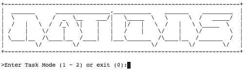
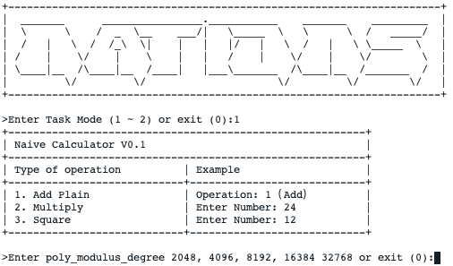
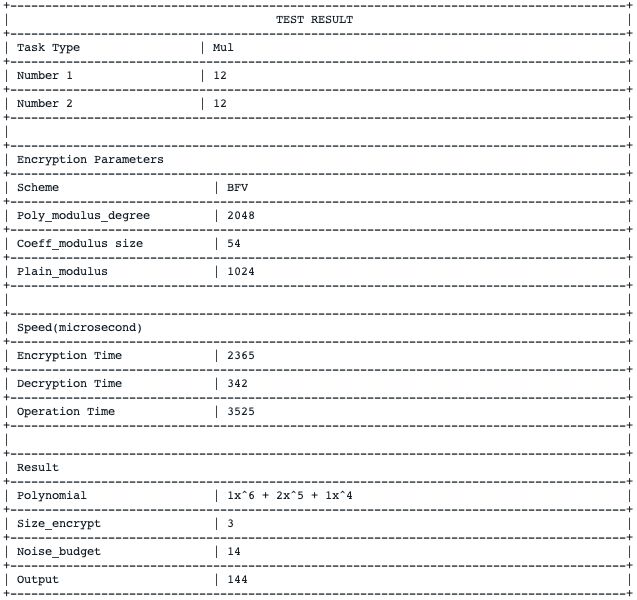
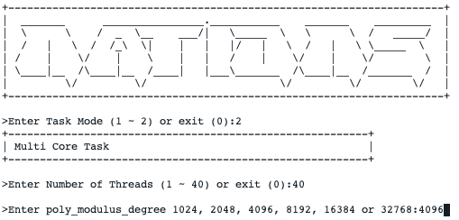
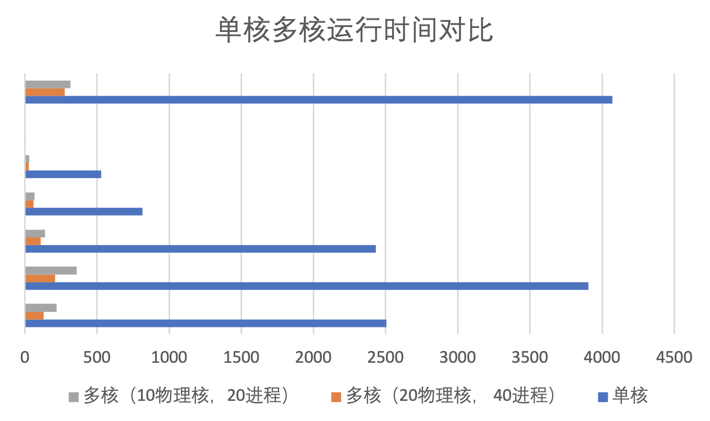

# Homomorphic Encryption Test System

>Microsoft SEAL, powered by open-source homomorphic encryption technology provides a set of encryption libraries that allow computations to be performed directly on encrypted data. This enables software engineers to build end-to-end encrypted data storage and computation services where the customer never needs to share their key with the service.

This System has two functions:

* Naive Homo-Calculator
* Multicore Speed Up 

## Build the System

* Build libseal-3.4.a library
```
  $ cd native/src 
  $ cmake .
  $ make
```
* Compile the system
```
  $ cd native/clustar 
  $ cmake .
  $ make
```
* The binary executable file is in ../bin
```
  $ ./clustarexample
```

## Run the System
* Main Page



* Naive Calculator



* Result of the Calculator



* Multicore Test



## Multicore Test Result



| 项目/核数/时间(us)        | 单核   |  20物理核  | 10物理核 
| :--------:   | :-----:  | :-----: | :----:  |
|生成公私钥| 3626| 129.435| 219.3425|
|生成重加密密钥| 5961.0| 211.261875| 360.29|
|加密Batch| 2475.9806| 108.91666233997155| 138.75064867733508|
|重加密Batch| 1126.277880| 60.67479623044097| 65.62042864141084|
|解密Batch| 549.771969| 28.482663762446656| 32.155655209013716|
|加法| 19.2815838| 1.1125972617354196| 1.220254735467015|
|乘法(无重加密)| 5461.657171| 275.052953769559| 316.19846464728937|
